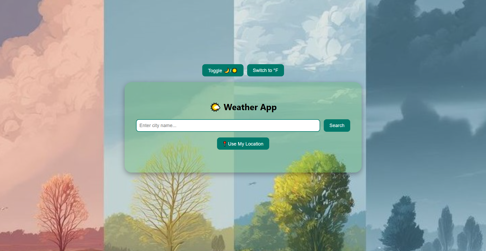
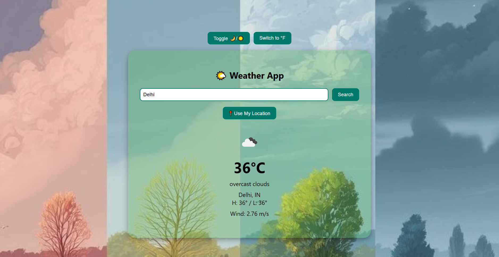
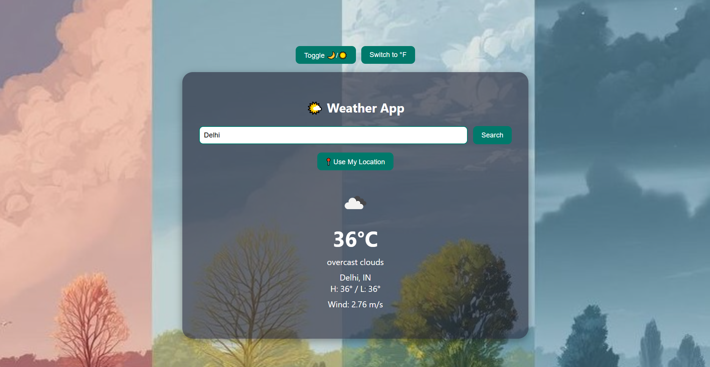

# 🌦️ Weather App

A fully responsive, client-side Weather App built using HTML, CSS, and JavaScript.
Search any city or use your current location to get real-time weather data along with humidity, precipitation, and UV index — all displayed in a modern, themed UI with light/dark toggle and unit conversion.

---

## 🚀 Features

- 🔍 Search by city or use 📍 Geolocation
- 🌤️ Displays current weather with icon, temperature, condition, highs/lows, and wind
- 💧 Info cards for Humidity, UV Index, and Precipitation
- 🌙 Dark Mode with transparent frosted-glass UI
- 🌡️ Toggle between Celsius and Fahrenheit
- 🌀 Clean loading state and user-friendly error handling
- 📱 Fully responsive, mobile-friendly design

---

## 📁 Project Structure

Weather_App/
├── index.html
├── style.css
├── script.js
└── README.md

---

### 📌 Home Page

### Modes (Light / Dark)

---

## 💻 Tech Stack

- **HTML5** – For structure and layout
- **CSS3** – For styling, responsiveness, and dark/light themes
- **JavaScript** – For API calls, UI updates, and logic
- **OpenWeatherMap API** – For real-time weather and forecast data

---

## 🧠 How it works?

- Enter a city name or click "Use My Location"
- Weather data is fetched from OpenWeatherMap
- Main card displays icon, temperature, wind, and highs/lows
- Additional cards show Humidity, UV Index, and Precipitation
- Toggle between °C/°F and Dark/Light themes
- View updates instantly with smooth transitions